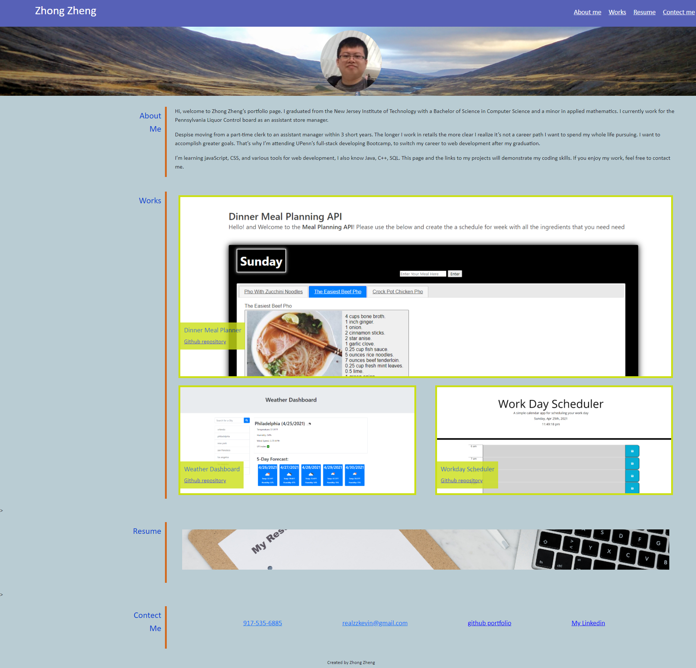
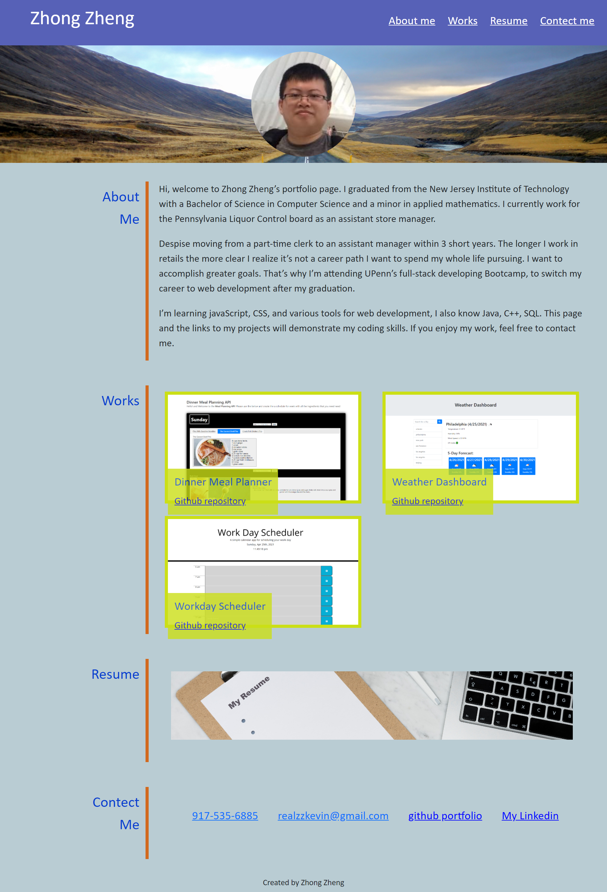

# Portfolio

## Description

The goal of this project is to create a webpage to display a professional work portfolio use HTML and CSS language. This portfolio will work as a showcase of skills and talents to any potential employer. It contains personal information like name, photo, contact information, resumes; and most importantly, a collection of deployed applications. This webpage is currently just a basic frame, I’ll update it with more personal information and application later on.
 

## Features

* Contain a collection of links of deployed applications.
 
* Responsive design, opitimization layout for various screen sizes and devices.
  
## Screenshots

Desktop:

Tablets:

smartphones

## Credits

[google](https://www.google.com) 

[Css Tricks](https://css-tricks.com/)

[updplash.com](https://unsplash.com/)

[picsum.photos](https://picsum.photos/)

## License

 This project is using the [MIT](./assets/LICENSE.txt) license.

## Links

[Portfolio project github page](https://github.com/realzzkevin/portfolio-of-work-ZZ)

[Portfolio](https://realzzkevin.github.io/portfolio-of-work-ZZ/)

